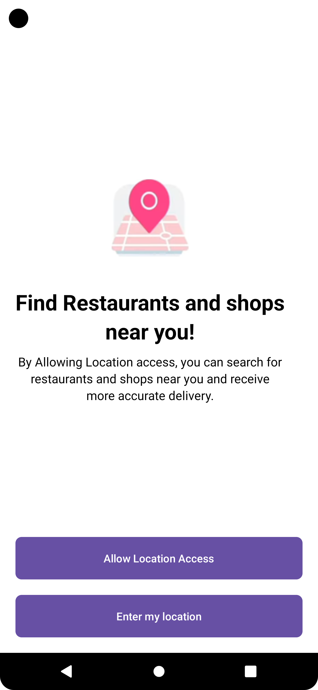
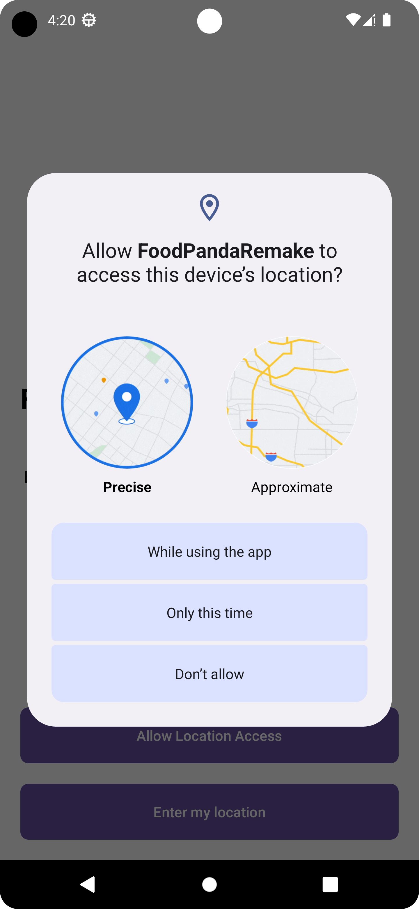
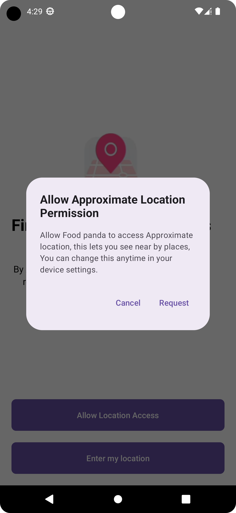

# Foodpanda Remake
This project is to remake Food panda application, While learning and implementing advance feature Android introduced for best development and its practices.

This project built on **```Jetpack Compose```** modern toolkit for building native UI, for more infomation see [Jetpack Compose](https://developer.android.com/jetpack/compose). This project use all the best practices with ```Clean Architecture```. Before you jump on the source code and understand app flow make sure you are already familiar with Prerequisites which is written below.

## Prerequisites 
- Experience with ```MVVM Architecture```.
- Basic knowledge of ```Jetpack Compose```.
- Familiarity with Architecture Components ```ViewModel```, ```LiveData```, ```Repository``` and ```Room```.
- Experience with Kotlin Coroutines and basic knowledge of ```Kotlin Flows```.
- A basic understanding of using threads on Android, including the main thread, background threads, and callbacks.

## Core Concept
- Dependency Injection with ```dagger-Hilt```.
- ```Kotlin Flows```.
- Testing: ```Unit Testing```, ```Instrumental Testing``` and ```UI Testing```.

## How to Clone App:
1. Clone this app using below syntax:

   > git clone https://github.com/EmTanveerSarbaz/FoodPandaRemake.git

## Clean Architecture Overview:
There are many architectures out there like MVC, MVP, MVVM, MVI, etc extending with clean code. They may sound odd but once you know the inner thing that would be very easy to understand and follow.

### Why Clean Architecture?

- **```Separation of Concerns:```** Separation of code in different modules or sections with specific responsibilities making it easier for maintenance and further modification.
- **```Loose coupling:```** flexible code anything can be easily be changed without changing the system
- **```Easily Testable```**

### Layers of Clean Architecture
- ```Presentation/UI Layer```
- ```Domain Layer (Optional)```
- ```Data Layer```

For more information check it out  [App Architecture](https://developer.android.com/topic/architecture).

Mostly android app used package structure look like this and names of folder is totally depend on your app requirement.

>  presentation:
>
> - **```ui:```** folder contains (views/compose)
> - **```viewmodel:```** 
>             
>  data
> 
> - **```data_source:```** folder contains like **DAO (Data Access Object)**, **Api interface** and other sources.
> - **```repository:```** folder contains (Repository Implementation)
> - **```model:```** used for map server data.
>            
>  domain
>         
>  - **```model:```** app model contains only the data required to be consumed on UI. (it would be a good practice to map the server model to the app model)
>  - **```repository:```** (Interface)
>  - **```use cases:```** Use case classes fit between ViewModels from the UI layer and repositories from the data layer. This means that use case classes usually depend on  >repository classes, and they communicate with the UI layer
>


In this project we package our structure differently.
>
> ```landing screen:```
>
>   - data
>       
>       - data_source
>       - model
>       - repository (Repository Implementation)
>     
>   - domain
>
>       - model
>       - repository (Interface)
>       - use cases
>
>   - presentation
>
>       - LandingScreen.kt
>       - LandingScreenViewModel.kt
>
>
> ```dashboard screen:```
>
> - data
>       
>   - data_source
>   - model 
>   - repository (Repository Implementation)
>     
> - domain
>
>   - model
>   - repository (Interface)
>   - use cases
>
> - presentation
>
>   - LandingScreen.kt
>   - LandingScreenViewModel.kt
>

### Why Structure like this?

If we take a axample of ```Data Layer``` then inside of it we have repository implementation, and when we need to find specific viewmodel repositoryImpl it hard to find beacuse all repo inside a single folder, yes we can distinguish then by creating folders, or we can search file names directly however in a larger project we cant remember everythings. so now we see in our app structure we simply put ```data```, ```domain```, ```presentation``` inside app screens package and when we need to find specific screen data we need to just select screen all data of that screen will be there.

## App Screenshot 📷:  

### Landing Location Screen

&nbsp;&nbsp;&nbsp;&nbsp;&nbsp;&nbsp;&nbsp;&nbsp;
